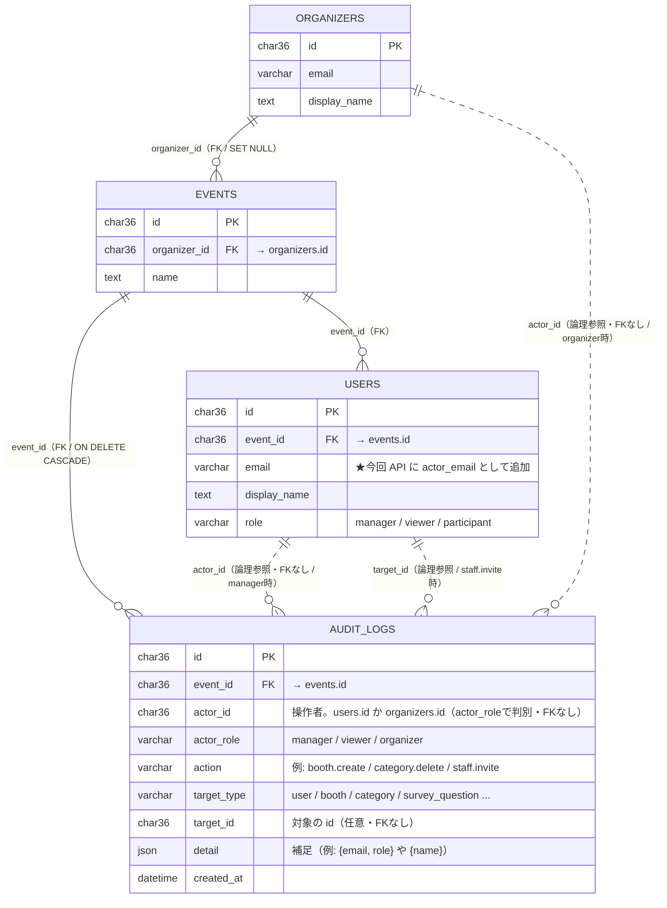

# DB 関係図: 変更履歴（監査ログ）

今回の変更で表示対応した **`audit_logs`（変更履歴）** を中心に、直接関係する
既存テーブルだけを図示する。既存テーブルは関係する列のみ記載（全列ではない）。

## ER 図

## 関係のポイント

- **実 FK は `audit_logs.event_id → events.id`（CASCADE）のみ。** イベント削除で
  そのイベントの監査ログも消える。
- **`actor_id` / `target_id` はポリモーフィック（FKなし）。** 操作者は
  `actor_role` で `users`（manager/viewer）か `organizers`（organizer）かが決まる。
- **変更履歴 API（`GET /admin/events/:id/audit-logs`）は `users` のみ LEFT JOIN** して
  操作者の `display_name` / `email` を解決する。
  そのため **actor が organizer の行は表示名・メアドが `null`**（UI では「（不明）」表示）。
  → 主催者の操作（イベント作成時の `staff.invite` 等）に操作者名を出したい場合は
  `organizers` も LEFT JOIN する追加改修が必要（未対応・任意）。
- viewer は参照専用のため **監査ログの actor には現れない**（作成されるのは manager /
  organizer の書き込み操作のみ）。図では `target_id` 経由で「招待された側」として登場する。

## 登録した例データ（ローカル Docker: event_support DB）

イベント `a2524686-e55b-40f6-8bc4-acbde57e73f3` に登録（`password123`）。

| created_at | actor_role | actor | action | target |
|---|---|---|---|---|
| 2026-07-01 09:00 | organizer | 主催者（organizer@example.com） | staff.invite | user: admin@example.com（manager）|
| 2026-07-01 09:02 | organizer | 主催者（organizer@example.com） | staff.invite | user: viewer@example.com（viewer）|
| 2026-07-01 10:15 | manager | admin@example.com | booth.create | booth: 受付ブース |
| 2026-07-01 10:20 | manager | admin@example.com | category.create | category: 飲食 |
| 2026-07-01 11:05 | manager | admin@example.com | booth.delete | booth: 旧ブース |

- 追加した動作検証用アカウント: `viewer@example.com`（role=viewer, password123）。
- organizer 行は上記のとおり変更履歴 UI では操作者名が「（不明）」になる（既知の挙動）。

## 補足

- テーブル定義の正本: `db/migrations/03_organizer_self_management.sql`（audit_logs / organizers）、
  `db/migrations/01_initial_schema.sql`（events / users）。
- 変更履歴機能の仕様: `docs/orders/2026-07-01-完了-変更履歴（監査ログ）admin表示.md`。
